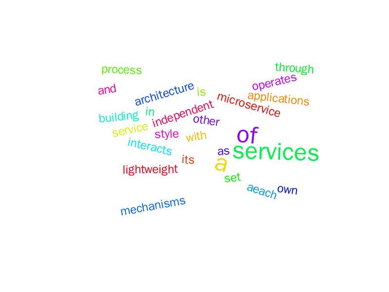

# Домашнее задание 3 по КПО

## Хашпаков Астемир БПИ242

# Система анализа файлов с антиплагиатом

## Описание
Микросервисная система для приема студенческих работ, анализа текста и проверки на плагиат. Система автоматически генерирует статистику и визуализирует содержание работ в виде облака слов.

## Архитектура
Система состоит из 3 независимых микросервисов:

### 1. File Storage Service (:8081)
- **Назначение:** Хранение файлов и метаданных
- **API:**
    - `POST /api/files/upload` - загрузка файла
    - `GET /api/files/{id}` - информация о файле
    - `GET /api/files/{id}/content` - содержимое файла
    - `GET /api/files/{id}/same` - количество одинаковых файлов
- **Технологии:** Spring Boot, JPA, PostgreSQL, SHA-256 хэширование

### 2. File Analysis Service (:8082)
- **Назначение:** Анализ текста и проверка плагиата
- **API:**
    - `GET /api/analysis/{id}` - статистика файла (абзацы, слова, символы)
    - `GET /api/analysis/{id}/plagiarised` - проверка на плагиат
    - `GET /api/analysis/{id}/wordcloud` - облако слов в формате PNG
- **Технологии:** Spring Boot, интеграция с QuickChart API, кэширование результатов

### 3. API Gateway (:8080)
- **Назначение:** Агрегация Swagger документации всех сервисов
- **Доступ:** `http://localhost:8080/swagger-ui/index.html`
- **Переключение между API:** выпадающий список в правом верхнем углу Swagger UI

## Взаимодействие сервисов
```
Клиент → Gateway (:8080) → Swagger документация
      ↘ Storage (:8081) → загрузка/получение файлов
      ↘ Analysis (:8082) → анализ/проверка плагиата/облако слов
      
Analysis → Storage → получение содержимого файлов для анализа
```

## Алгоритм проверки плагиата
1. При загрузке файла вычисляется SHA-256 хэш содержимого
2. Хэш сохраняется в базу данных
3. При проверке плагиата система ищет файлы с одинаковым хэшем
4. **Плагиат = true**, если существует более ранняя сдача с идентичным хэшем
5. **Плагиат = false**, если файл уникальный или первый в системе

## Запуск системы
```bash
# 1. Собрать и запустить все сервисы
docker compose up --build

# 2. Проверить состояние
docker compose ps

# 3. Остановить систему
docker compose down
```

## Тестирование
```bash
# Загрузка файла
curl -X POST -F "file=@test.txt" http://localhost:8081/api/files/upload

# Анализ файла (замените {id} на реальный ID)
curl http://localhost:8082/api/analysis/{id}

# Проверка плагиата
curl http://localhost:8082/api/analysis/{id}/plagiarised

# Облако слов
curl http://localhost:8082/api/analysis/{id}/wordcloud -o cloud.png
```

## Покрытие тестами
- **File Storage Service:** 74%
- **File Analysis Service:** 80%
- **Интеграционные тесты:** проверка взаимодействия сервисов

## Структура проекта
```
├── analysis/          # Сервис анализа
├── gateway/           # API Gateway
├── storage/           # Сервис хранения
├── docker-compose.yml # Оркестрация контейнеров
└── README.md          # Документация
```

## Особенности реализации
- Все сервисы запускаются в отдельных Docker-контейнерах
- Gateway агрегирует документацию, но бизнес-запросы идут напрямую к сервисам
- Для генерации облака слов требуется текстовый файл (бинарные файлы вернут ошибку)
- Результаты анализа кэшируются в БД для повышения производительности

### Демонстрация облака слов

Система анализирует текст и генерирует визуальное представление в виде облака слов, где размер каждого слова пропорционален его частоте в тексте.



*Облако слов для текста о микросервисной архитектуре*

## Система разработана в рамках курса "Конструирование программного обеспечения".